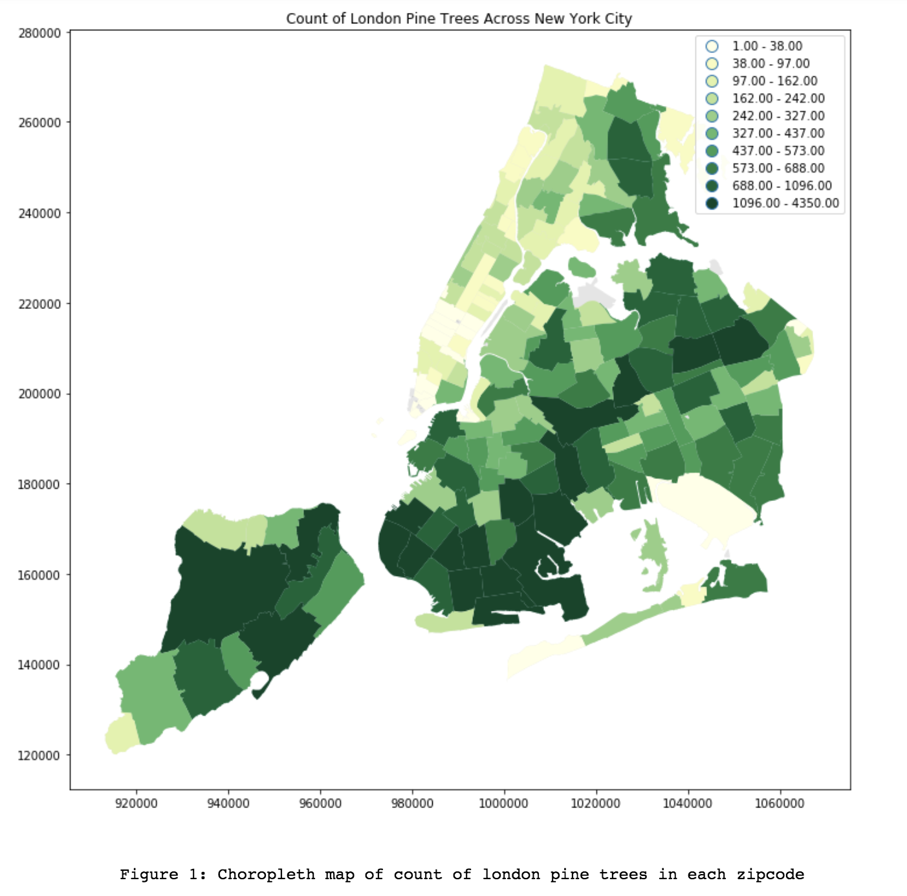

# Review of Rachel Lim's plot **Count of London Pine Trees Across New York City**
## Homework 9 Assignment 1



### Clarity
##### is the plot easy to read? is it clear or confusing, are the quantities being visualized ambiguous? 

The plot is relatively straight forward to read, where deeper green represents more trees which is quite intuitive. The thing that bothers me most, is the decimal places in the legend. First, they don't add any information, and would serve just as well as not being there. Secondly, if you're discussing counts, you're not going to have fractional trees so the decimal places perhaps imply that you might. I looked into your implementation and looked into both the matplotlib and pandas documentation/source to see if I could find a format string parameter somewhere that would let you change this, but I came up empty handed so I am going to assume that it is not fixable through the interface that you're using. I came across [this notebook](http://nbviewer.jupyter.org/gist/jorisvandenbossche/d4e6efedfa1e4e91ab65) that has a function, `plot_dataframe` that you could use and just change the format string here. Just change this line:

```python
# in plot_dataframe(...) about halfway down
categories = ['{0:.2f} - {1:.2f}'.format(binedges[i], binedges[i+1]) for i in range(len(binedges)-1)]
# to 
categories = ['{0:.0f} - {1:.0f}'.format(binedges[i], binedges[i+1]) for i in range(len(binedges)-1)]
```


### Aesthetic
##### beautiful is a subjective judgment: you should not judge the plot on the basis of whether you think it is "beautiful", but you should judge whether its esthetic is functional to what it is meant to communicate. Are the colors chosen appropriately? Are the graphical elements used appropriate to represent the quantities being visualized? Are the graphical choices allowing you to focus on the right elements or are they distracting you?

Using green for the color map is (though obvious I suppose) a very good choice as it emulates satellite imagery and therefore makes it an effective and intuitive use of color. The lighter color at the lower end of the scale can be difficult to see especially against the white background. The plot might benefit from a contrasting background, like a light grey, or a blue. This is only really a problem with Midtown and the Battery Park area so it isn't a huge issue, but it would make the plot easier to read. The legend isn't really a problem because it is placed where it is not really obstructing any zipcodes except for a small corner of one in the Bronx, but seeing as you have large swaths of whitespace in the top left, I think the legend would be better placed there where it would not overlap with any of the map. I'm also not sure if the axis ticks and labels are necessary and I'd probably remove them.


### Honesty
##### is the plot honestly reproducing the data or is it deforming it, perhaps to emphasize a point?

The only misleading part of this plot is that it uses absolute counts of trees, which is generally a function of the area of the zipcode that you're looking in, so for example a small area may have a high number of trees, but may still have less trees overall than a much larger area with a sparser distribution of trees. You are being honest because you do say that you're displaying the absolute count, but intuitively people misread the graph as darker green equals higher density of trees. Perhaps the way to address this would be to use tree density instead of absolute counts, where you could normalize by the total area in that zipcode. This would also eliminate the need to remove decimal places from the legend discussed above because now you would be dealing with a decimal scale. 


Good job Rachel! :D